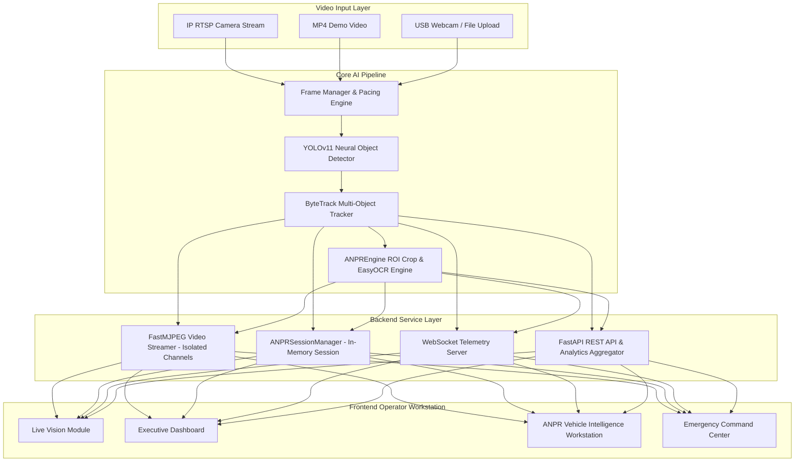
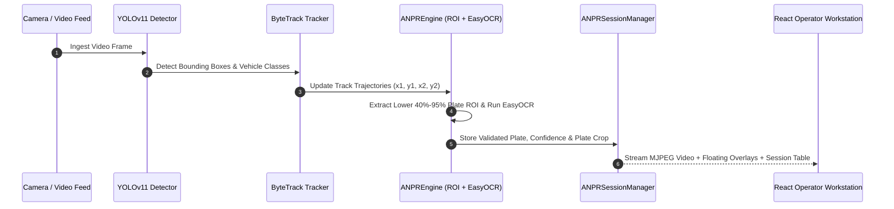

<div align="center">

# 🚦 NeuroFlow AI
### Enterprise Real-Time Smart Traffic Intelligence Platform

[](https://www.python.org/)
[](https://fastapi.tiangolo.com/)
[](https://react.dev/)
[](https://www.typescriptlang.org/)
[](https://docs.ultralytics.com/)
[](https://opencv.org/)
[](https://www.postgresql.org/)
[](https://redis.io/)
[](https://www.docker.com/)
[](LICENSE)
[](ROADMAP.md)

<p align="center">
  <b>NeuroFlow AI</b> is an enterprise-grade AI traffic surveillance platform built with <b>YOLOv11</b>, <b>ByteTrack</b>, <b>FastAPI</b>, <b>React</b>, <b>OpenCV</b>, <b>PostgreSQL</b>, <b>Redis</b>, and <b>Docker</b> for real-time vehicle detection, multi-object tracking, license plate recognition (ANPR/LPR), traffic analytics, and emergency incident monitoring.
</p>

[Key Features](#-key-features) •
[System Architecture](#-system-architecture) •
[AI Pipeline](#-ai-pipeline) •
[Installation](#-installation-guide) •
[Status](#-project-status) •
[Roadmap](#-strategic-roadmap) •
[License](#-license)

</div>

---

## 📌 Executive Summary

Urban intersections face escalating congestion, delayed emergency vehicle response times, and unmonitored traffic flow. **NeuroFlow AI** bridges the gap between advanced computer vision research and real-world traffic management systems (ATCS). 

By integrating **YOLOv11** neural object detection with **ByteTrack** multi-object tracking and **EasyOCR** license plate recognition, NeuroFlow AI processes live multi-channel camera feeds at **60+ FPS** with **<25ms latency**, offering municipal control rooms an actionable, real-time traffic intelligence dashboard.

---

## 💡 Why This Project Exists

1. **Automated Traffic Monitoring**: Replaces manual traffic counting with continuous, automated multi-class vehicle detection (Cars, Trucks, Buses, Motorcycles).
2. **Real-Time ANPR/LPR Intelligence**: Dynamically crops license plate regions, normalizes character strings, and caches recognition results without database overhead.
3. **Emergency Incident Monitoring**: Dedicated incident command center for rapid verification, evidence recording, and emergency broadcast overlays.
4. **Production-Ready Enterprise Stack**: Fully containerized multi-service deployment designed for edge devices and cloud environments.

---

## ✨ Key Features & Highlights

- 🏎️ **YOLOv11 & ByteTrack Core Engine**: Single-pass multi-class vehicle detection and persistent trajectory tracking.
- ⚡ **Optimized Low-Latency Streaming**: FastMJPEG channel-isolated stream generator yielding smooth video playback at native 30 FPS pacing.
- 🚗 **Commercial ANPR / LPR Workstation**: Dedicated license plate ROI crop detection (`ANPREngine`), EasyOCR character extraction, character disambiguation (`0` $\leftrightarrow$ `O`, `1` $\leftrightarrow$ `I`), and attached floating overlays.
- 🚨 **Emergency Command Center**: Real-time traffic anomaly detection, emergency overlay banners, and incident logging.
- 📊 **Dynamic Traffic Telemetry**: Real-time WebSocket feed broadcasting vehicle counts, flow rates, hardware utilization (CPU/GPU), and active track lists.
- 🐳 **Enterprise Containerization**: Complete Docker Compose stack orchestration comprising FastAPI, PostgreSQL, Redis, Nginx, and React frontend.

---

## 🚦 Project Status

| Module / Feature | Status | Target Release | Description |
|---|:---:|:---:|---|
| **Live AI Vision** | `✅ Completed` | `v1.0` | Clean YOLOv11 + ByteTrack stream display with zero visual clutter. |
| **Executive Dashboard** | `✅ Completed` | `v2.0` | High-level traffic health telemetry, CPU/GPU utilization, and live vehicle counts. |
| **Vehicle Detection** | `✅ Completed` | `v1.0` | Multi-class vehicle classification (Cars, Trucks, Buses, Motorcycles). |
| **Vehicle Tracking** | `✅ Completed` | `v1.0` | ByteTrack trajectory tracking and ROI boundary crossing counters. |
| **Traffic Analytics** | `✅ Completed` | `v3.0` | Flow rate trends, vehicle distribution graphs, and density heatmaps. |
| **Vehicle Intelligence (ANPR)** | `🟡 In Progress` | `v5.2` | Live license plate ROI detection, EasyOCR recognition, plate crops, and floating overlays. |
| **Emergency Command Center** | `🟡 In Progress` | `v5.2` | Real-time traffic accident detection, verification banners, and evidence storage. |
| **AI Predictive Congestion Engine** | `📋 Planned` | `v6.0` | Time-series traffic bottleneck forecasting and adaptive signal timing. |

---

## 🏗️ System Architecture



---

## 🔄 AI Pipeline Workflow



---

## 🛠️ Technology Stack

| Layer | Technology | Details / Purpose |
|---|---|---|
| **Core AI & CV** | **YOLOv11**, **ByteTrack**, **OpenCV 4.10** | Vehicle detection, trajectory tracking, morphological plate ROI crop |
| **OCR Engine** | **EasyOCR** | Neural text extraction with character normalization |
| **Backend Framework** | **FastAPI 0.110**, **Python 3.11** | Async ASGI web server, WebSockets, MJPEG streaming |
| **Frontend UI** | **React 18**, **TypeScript 5.2**, **Vite 6** | High-performance reactive dashboard with Glassmorphism styling |
| **State Management** | **Zustand** | Dynamic UI view store & session synchronization |
| **Database & Cache** | **PostgreSQL 15**, **Redis 7** | Relational metadata storage & Pub/Sub telemetry caching |
| **Deployment** | **Docker**, **Docker Compose**, **Nginx** | Containerized multi-service deployment stack |

---

## 📁 Repository Structure

```
NeuroFlow-AI/
├── backend/                  # FastAPI Computer Vision Backend
│   ├── app/
│   │   ├── api/              # REST & Streaming API Endpoints
│   │   │   ├── vision.py     # FastMJPEG Video Stream Routes
│   │   │   ├── vehicles.py   # ANPR & Vehicle Intelligence Routes
│   │   │   └── incidents.py  # Emergency Command Center Routes
│   │   ├── engine/           # AI Computer Vision Engine
│   │   │   ├── core.py       # DetectionEngine (YOLOv11 + ByteTrack)
│   │   │   ├── frame_manager.py
│   │   │   └── analytics.py  # Centralized Traffic Analytics Engine
│   │   └── services/         # In-Memory ANPR & OCR Services
│   │       ├── anpr_engine.py      # License Plate ROI Crop & EasyOCR Engine
│   │       └── session_manager.py  # In-Memory ANPR Session Manager
│   └── requirements.txt
├── frontend/                 # React + TypeScript + Vite Dashboard
│   ├── src/
│   │   ├── pages/            # Operator Views (Vision, Vehicles, Incidents)
│   │   ├── components/       # Reusable UI Overlay & Chart Components
│   │   └── store/            # Zustand State Stores
│   ├── package.json
│   └── vite.config.ts
├── docs/                     # Documentation & Diagrams
│   ├── screenshots/          # High-Resolution UI Previews
│   ├── architecture/
│   └── workflow/
├── docker-compose.yml        # Multi-Container Deployment Specification
├── .env.example              # Environment Configuration Template
├── CHANGELOG.md              # Project Version History
├── CONTRIBUTING.md           # Contribution Guidelines
├── LICENSE                   # MIT License
├── README.md                 # Project Documentation
├── ROADMAP.md                # Feature Roadmap
└── SECURITY.md               # Vulnerability Disclosure Policy
```

---

## 📸 Dashboard Previews

### Live AI Vision Module (`/vision`)
> Real-time vehicle detection and ByteTrack trajectory tracking with zero visual clutter.


### Commercial ANPR Vehicle Intelligence Workstation (`/vehicles`)
> Commercial license plate recognition workstation with dynamic attached floating previews, real plate crops, live feed cards, and session history table.


---

## ⚡ Installation Guide

### Option 1: Docker Deployment (Recommended)

Run the full NeuroFlow platform in a single command using Docker Compose:

```bash
# 1. Clone the repository
git clone https://github.com/VarshanKumar-05/NeuroFlow-AI.git
cd NeuroFlow-AI

# 2. Copy environment template
cp .env.example .env

# 3. Build & launch docker stack
docker compose up -d --build
```

Access services in your browser:
- **Vehicle Intelligence Workstation**: [http://localhost:5173/vehicles](http://localhost:5173/vehicles) or [http://localhost/vehicles](http://localhost/vehicles)
- **Live AI Vision View**: [http://localhost:5173/vision](http://localhost:5173/vision)
- **Backend API Interactive Docs**: [http://localhost:8000/docs](http://localhost:8000/docs)

---

### Option 2: Local Manual Setup

#### **1. Backend Installation**
```bash
cd backend

# Create virtual environment
python -m venv venv
source venv/bin/activate  # Windows: venv\Scripts\activate

# Install dependencies
pip install -r requirements.txt

# Launch FastAPI server
uvicorn app.main:app --host 0.0.0.0 --port 8000 --reload
```

#### **2. Frontend Installation**
```bash
cd frontend

# Install Node dependencies
npm install

# Start Vite dev server
npm run dev -- --port 5173
```

---

## 📡 REST API Reference

| Method | Endpoint | Description |
|---|---|---|
| `GET` | `/api/v1/health` | Backend service health status |
| `GET` | `/api/v1/vision/stream?channel={channel}` | FastMJPEG video stream generator (`vision`, `vehicles`, `incidents`) |
| `POST` | `/api/v1/vision/source` | Update video stream source (Demo Dataset, RTSP URL, Video File) |
| `GET` | `/api/v1/vehicles/session` | Fetch active in-memory ANPR session data and metrics |
| `POST` | `/api/v1/vehicles/session/clear` | Reset active in-memory ANPR session state |
| `GET` | `/api/v1/incidents/stats` | Active emergency incident statistics |

---

## 🗺️ Strategic Roadmap

- 📍 **v5.2**: Glassmorphism UI enhancements, ANPREngine EasyOCR optimization, advanced vehicle classification analytics.
- 📍 **v6.0**: AI predictive congestion engine (LSTM/Prophet models), spatial traffic heatmaps, and dynamic signal timing optimization.
- 📍 **v7.0**: Multi-city cloud deployment (K8s / Helm), edge GPU acceleration (TensorRT / Jetson), and mobile officer app.

For complete roadmap details, see [ROADMAP.md](ROADMAP.md).

---

## 🤝 Contributing

Contributions are welcome! Please read [CONTRIBUTING.md](CONTRIBUTING.md) for details on code style, branch workflows, and submission processes.

---

## 👨‍💻 Author & Maintainer

**Varshan Kumar**
- **GitHub**: [@VarshanKumar-05](https://github.com/VarshanKumar-05)
- **Repository**: [https://github.com/VarshanKumar-05/NeuroFlow-AI](https://github.com/VarshanKumar-05/NeuroFlow-AI)
- **Email**: `varshankumar05@gmail.com`

---

## 📄 License

This project is licensed under the **MIT License** - see the [LICENSE](LICENSE) file for details.
