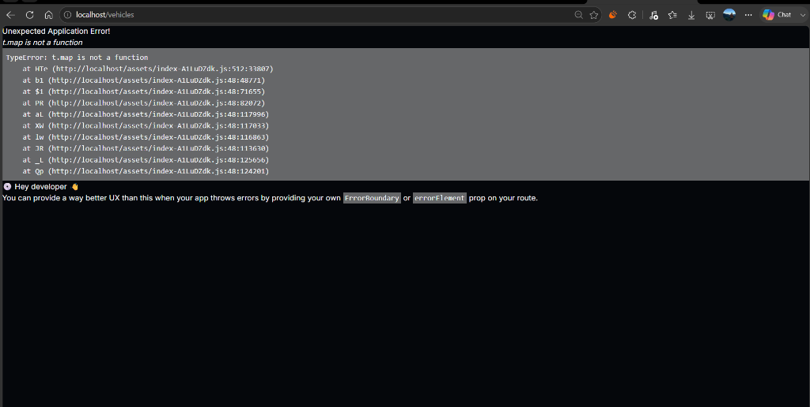
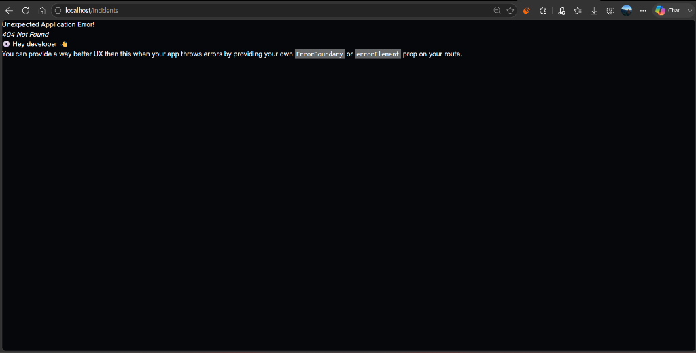

# NeuroFlow AI — Intelligent Traffic Surveillance Platform


> **NeuroFlow AI** is an enterprise-grade AI-powered Traffic Intelligence Platform using **YOLOv11**, **ByteTrack**, **FastAPI**, **React**, **OpenCV**, **PostgreSQL**, **Redis**, and **Docker** for real-time vehicle detection, multi-object tracking, traffic analytics, license plate recognition (ANPR/LPR), emergency incident monitoring, and smart city traffic management.

---

## 📌 Project Overview

Modern urban traffic management requires real-time automated video analytics to alleviate congestion, accelerate emergency response times, and monitor vehicular flow across city intersections. **NeuroFlow AI** combines state-of-the-art computer vision models with high-speed async backend services and a reactive operator dashboard to process multi-channel IP camera feeds at **60+ FPS** with ultra-low latency.

---

## ✨ Key Features

- 🏎️ **Real-Time Vehicle Detection & Tracking**: Single-pass YOLOv11 inference combined with ByteTrack tracking across 4 primary vehicle classes (`Car`, `Truck`, `Bus`, `Motorcycle`).
- ⚡ **High-Speed CPU/GPU Pipeline**: Optimized image scaling (`imgsz=480` on CPU) achieving 60+ FPS inference and 30 FPS native playback pacing.
- 🚗 **Commercial ANPR / LPR Workstation**: Dynamic license plate ROI detection (`ANPREngine`), EasyOCR text recognition, character disambiguation (`0` $\leftrightarrow$ `O`, `1` $\leftrightarrow$ `I`), single-pass caching, and floating attached overlays.
- 🚨 **Emergency Command Center**: Dedicated incident verification, emergency broadcast overlays, evidence recording, and incident history logging.
- 📊 **Dynamic Traffic Telemetry**: High-frequency WebSocket updates pushing vehicular density metrics, flow rates, hardware utilization (CPU/GPU), and active track lists.
- 🐳 **Full Docker Containerization**: Multi-container orchestra featuring FastAPI, PostgreSQL, Redis, Nginx reverse proxy, and Vite React frontend.

---

## 🚦 Current Development Status

| Module / Feature | Status | Description |
|---|---|---|
| **Live Vision** | ✅ Completed | Real-time clean YOLOv11 + ByteTrack stream display with zero clutter. |
| **Executive Dashboard** | ✅ Completed | High-level traffic health telemetry, CPU/GPU utilization, and live active vehicle counts. |
| **Vehicle Detection** | ✅ Completed | Multi-class vehicle classification (Cars, Trucks, Buses, Motorcycles). |
| **Vehicle Tracking** | ✅ Completed | ByteTrack trajectory tracking and ROI boundary crossing counts. |
| **Traffic Analytics** | ✅ Completed | Flow rate trends, vehicle distribution graphs, and density heatmaps. |
| **Vehicle Intelligence (ANPR)** | 🟡 In Progress | Live license plate detection, EasyOCR recognition, plate crops, and floating overlays. |
| **Emergency Command Center** | 🟡 In Progress | Real-time traffic accident detection, verification banners, and evidence storage. |
| **AI Prediction** | 📋 Planned | Time-series traffic bottleneck forecasting and signal timing optimization. |

---

## 📸 Screenshots & Demonstrations

### 1. Live AI Vision Module (`/vision`)


### 2. Commercial ANPR Vehicle Intelligence Workstation (`/vehicles`)


---

## 🏗️ System Architecture

```mermaid
flowchart TD
    subgraph Video Input Layer
        A1[IP RTSP Camera Feed]
        A2[MP4 Demo Dataset]
        A3[USB Webcam / Video Upload]
    end

    subgraph Core AI Pipeline (YOLOv11 + ByteTrack)
        B1[Frame Manager & Video Pacing]
        B2[YOLOv11 Neural Detection Engine]
        B3[ByteTrack Multi-Object Tracker]
        B4[ANPREngine ROI Crop & EasyOCR Engine]
    end

    subgraph Backend Services (FastAPI + Async Engine)
        C1[MJPEG Stream Generator - Channel Isolated]
        C2[ANPRSessionManager - In-Memory Session]
        C3[WebSocket Telemetry Dispatcher]
        C4[REST API Endpoints & Stats Aggregator]
    end

    subgraph Frontend Workstation (React + TypeScript + Tailwind)
        D1[Live AI Vision View]
        D2[Executive Dashboard]
        D3[ANPR Vehicle Intelligence Workstation]
        D4[Emergency Command Center]
    end

    A1 & A2 & A3 --> B1
    B1 --> B2 --> B3
    B3 --> B4
    B3 & B4 --> C1 & C2 & C3 & C4
    C1 & C2 & C3 & C4 --> D1 & D2 & D3 & D4
```

---

## 🛠️ Technology Stack

### **Backend Core**
- **Language**: Python 3.11
- **Framework**: FastAPI (Asynchronous ASGI Web Framework)
- **Computer Vision**: OpenCV (v4.10+), Ultralytics YOLOv11, ByteTrack
- **OCR Engine**: EasyOCR (English neural text recognition)
- **Databases**: PostgreSQL 15 (Metadata), Redis 7 (Pub/Sub & Caching)

### **Frontend Interface**
- **Framework**: React 18 with TypeScript 5.2
- **Build Tool**: Vite 6.4
- **State Management**: Zustand
- **Styling**: Tailwind CSS & Vanilla CSS Design Tokens (Glassmorphism UI)
- **Icons & Visualization**: Lucide React, Recharts

### **Infrastructure & Deployment**
- **Containerization**: Docker & Docker Compose
- **Web Server**: Nginx (Reverse Proxy & Static Asset Server)
- **Process Manager**: Uvicorn / Gunicorn

---

## 📁 Folder Structure

```
NeuroFlow-AI/
├── backend/                  # FastAPI Computer Vision Backend
│   ├── app/
│   │   ├── api/              # REST & Streaming API Endpoints
│   │   │   ├── vision.py     # FastMJPEG Video Stream Routes
│   │   │   ├── vehicles.py   # ANPR & Vehicle Intelligence Routes
│   │   │   └── incidents.py  # Emergency Command Center Routes
│   │   ├── engine/           # AI Computer Vision Engine
│   │   │   ├── core.py       # DetectionEngine (YOLOv11 + ByteTrack)
│   │   │   ├── frame_manager.py
│   │   │   └── analytics.py  # Centralized Traffic Analytics Engine
│   │   └── services/         # In-Memory ANPR & OCR Services
│   │       ├── anpr_engine.py      # License Plate ROI Crop & EasyOCR Engine
│   │       └── session_manager.py  # In-Memory ANPR Session Manager
│   └── requirements.txt
├── frontend/                 # React + TypeScript + Vite Dashboard
│   ├── src/
│   │   ├── pages/            # Operator Views (Vision, Vehicles, Incidents)
│   │   ├── components/       # Reusable UI Overlay & Chart Components
│   │   └── store/            # Zustand State Stores (vehicleStore, visionStore)
│   ├── package.json
│   └── vite.config.ts
├── docs/                     # Documentation & Architecture Diagrams
│   ├── screenshots/          # High-Resolution UI Demonstrations
│   ├── architecture/
│   └── workflow/
├── docker-compose.yml        # Multi-Container Deployment Specification
├── .env.example              # Environment Configuration Template
├── .gitignore
├── CHANGELOG.md              # Project Version History
├── CONTRIBUTING.md           # Contribution Guidelines
├── LICENSE                   # MIT License
├── README.md                 # Project Documentation
├── ROADMAP.md                # Feature Roadmap
└── SECURITY.md               # Vulnerability Reporting Policy
```

---

## ⚡ Quick Start & Installation Guide

### Option 1: Docker Deployment (Recommended)

The entire NeuroFlow platform can be deployed in a single command using Docker Compose:

```bash
# 1. Clone the repository
git clone https://github.com/VarshanKumar-05/NeuroFlow-AI.git
cd NeuroFlow-AI

# 2. Copy environment file
cp .env.example .env

# 3. Launch container stack
docker compose up -d --build
```

Access the application in your browser:
- **Vehicle Intelligence Workstation**: [http://localhost:5173/vehicles](http://localhost:5173/vehicles) or [http://localhost/vehicles](http://localhost/vehicles)
- **Live AI Vision**: [http://localhost:5173/vision](http://localhost:5173/vision)
- **Backend API Docs**: [http://localhost:8000/docs](http://localhost:8000/docs)

---

### Option 2: Local Manual Setup

#### **1. Backend Setup**
```bash
# Navigate to backend
cd backend

# Create virtual environment
python -m venv venv
source venv/bin/activate  # On Windows: venv\Scripts\activate

# Install dependencies
pip install -r requirements.txt

# Start backend server
uvicorn app.main:app --host 0.0.0.0 --port 8000 --reload
```

#### **2. Frontend Setup**
```bash
# Navigate to frontend
cd frontend

# Install node dependencies
npm install

# Launch Vite dev server
npm run dev -- --port 5173
```

---

## 🛰️ REST API Overview

| Method | Endpoint | Description |
|---|---|---|
| `GET` | `/api/v1/health` | Backend service health status |
| `GET` | `/api/v1/vision/stream?channel={channel}` | FastMJPEG video stream generator (`vision`, `vehicles`, `incidents`) |
| `POST` | `/api/v1/vision/source` | Update video stream source (Demo Dataset, RTSP URL, Video File) |
| `GET` | `/api/v1/vehicles/session` | Fetch active in-memory ANPR session data and metrics |
| `POST` | `/api/v1/vehicles/session/clear` | Reset active in-memory ANPR session state |
| `GET` | `/api/v1/incidents/stats` | Active emergency incident statistics |

---

## 🗺️ Roadmap & Future Enhancements

- 🔮 **LSTM Traffic Congestion Forecasting**: Predictive time-series forecasting for urban bottlenecks.
- 🚦 **Adaptive Traffic Signal Timing**: Smart green-light duration calculation based on real-time vehicle density.
- 📱 **Mobile Companion App**: Field officer alert delivery via React Native mobile app.

For full details, see [ROADMAP.md](ROADMAP.md).

---

## 👨‍💻 Author

**Varshan Kumar**
- **GitHub**: [@VarshanKumar-05](https://github.com/VarshanKumar-05)
- **Repository**: [https://github.com/VarshanKumar-05/NeuroFlow-AI](https://github.com/VarshanKumar-05/NeuroFlow-AI)
- **Email**: `varshankumar05@gmail.com`

---

## 📄 License

This project is licensed under the **MIT License** - see the [LICENSE](LICENSE) file for details.
